# 1847 Ventures – Entity Relationship Diagram

> Generated from `Farmers/models.py`. Rendered with [Mermaid](https://mermaid.js.org/).

```mermaid
erDiagram

    %% ─────────────────────────────────────────────
    %% FARMER  (Custom User – extends AbstractUser)
    %% ─────────────────────────────────────────────
    FARMER {
        int         id                  PK
        varchar     username
        varchar     password
        varchar     email
        varchar     first_name
        varchar     last_name
        varchar     phone_number
        uuid        farmer_id           "unique, not editable"
        datetime    registration_date
        boolean     is_active
        boolean     is_staff
        boolean     is_superuser
        datetime    date_joined
        datetime    last_login
    }

    %% ─────────────────────────────────────────────
    %% USER PROFILE
    %% ─────────────────────────────────────────────
    USER_PROFILE {
        int         id                  PK
        int         user_id             FK
        varchar     role                "farmer | investor | field_agent | admin"
        boolean     is_approved
    }

    %% ─────────────────────────────────────────────
    %% FARM
    %% ─────────────────────────────────────────────
    FARM {
        int         id                  PK
        int         owner_id            FK
        varchar     name
        varchar     location
        float       size_in_hectares
        datetime    created_at
    }

    %% ─────────────────────────────────────────────
    %% CROP
    %% ─────────────────────────────────────────────
    CROP {
        int         id                  PK
        int         farm_id             FK
        varchar     name
        date        planting_date
        date        harvest_date
        decimal     expected_yield_kg
    }

    %% ─────────────────────────────────────────────
    %% HARVEST
    %% ─────────────────────────────────────────────
    HARVEST {
        int         id                  PK
        int         farm_id             FK
        date        date_of_harvest
        float       tons_produced
        varchar     quality_grade
    }

    %% ─────────────────────────────────────────────
    %% INVESTMENT
    %% ─────────────────────────────────────────────
    INVESTMENT {
        int         id                          PK
        int         investor_id                 FK  "nullable"
        int         farm_id                     FK  "nullable"
        decimal     amount
        decimal     expected_return_percentage
        datetime    invested_at
    }

    %% ─────────────────────────────────────────────
    %% FARM ACTIVITY
    %% ─────────────────────────────────────────────
    FARM_ACTIVITY {
        int         id              PK
        int         farmer_id       FK
        varchar     activity_type   "planting | pruning | spraying | harvesting"
        date        date
        text        inputs_used
        float       quantity
        text        notes
    }

    %% ─────────────────────────────────────────────
    %% ANNOUNCEMENT
    %% ─────────────────────────────────────────────
    ANNOUNCEMENT {
        int         id              PK
        int         created_by_id   FK
        varchar     title
        text        message
        datetime    created_at
        boolean     is_active
    }

    %% ─────────────────────────────────────────────
    %% MESSAGE
    %% ─────────────────────────────────────────────
    MESSAGE {
        int         id          PK
        int         sender_id   FK
        int         receiver_id FK
        text        content
        datetime    created_at
        boolean     is_read
    }

    %% ─────────────────────────────────────────────
    %% DJANGO AUTH – Group & Permission (built-in)
    %% ─────────────────────────────────────────────
    AUTH_GROUP {
        int     id      PK
        varchar name
    }

    AUTH_PERMISSION {
        int     id          PK
        int     content_type_id FK
        varchar codename
        varchar name
    }

    %% ─────────────────────────────────────────────
    %% M2M JUNCTION TABLES (Django auto-creates)
    %% ─────────────────────────────────────────────
    FARMER_GROUPS {
        int farmer_id   FK
        int group_id    FK
    }

    FARMER_USER_PERMISSIONS {
        int farmer_id       FK
        int permission_id   FK
    }

    %% ═════════════════════════════════════════════
    %% RELATIONSHIPS
    %% ═════════════════════════════════════════════

    %% Each Farmer has exactly one UserProfile (created via signal)
    FARMER ||--|| USER_PROFILE : "has profile"

    %% A Farmer (as owner) may own many Farms
    FARMER ||--o{ FARM : "owns"

    %% A Farm contains many Crops
    FARM ||--o{ CROP : "grows"

    %% A Farm records many Harvests
    FARM ||--o{ HARVEST : "produces"

    %% A Farmer (acting as investor) makes many Investments; each Investment targets one Farm
    FARMER ||--o{ INVESTMENT : "invests"
    FARM   ||--o{ INVESTMENT : "receives investment"

    %% A Farmer logs many Farm Activities
    FARMER ||--o{ FARM_ACTIVITY : "performs"

    %% An Admin (Farmer with admin role) creates Announcements
    FARMER ||--o{ ANNOUNCEMENT : "creates"

    %% A Farmer sends and receives Messages
    FARMER ||--o{ MESSAGE : "sends"
    FARMER ||--o{ MESSAGE : "receives"

    %% M2M: Farmer ↔ Group (via junction table)
    FARMER      ||--o{ FARMER_GROUPS       : "belongs to"
    AUTH_GROUP  ||--o{ FARMER_GROUPS       : "includes"

    %% M2M: Farmer ↔ Permission (via junction table)
    FARMER          ||--o{ FARMER_USER_PERMISSIONS : "has"
    AUTH_PERMISSION ||--o{ FARMER_USER_PERMISSIONS : "granted to"
```

---

## Relationship Summary

| Relationship | Type | FK Location | Notes |
|---|---|---|---|
| `Farmer` → `UserProfile` | One-to-One | `UserProfile.user_id` | Auto-created via `post_save` signal |
| `Farmer` → `Farm` | One-to-Many | `Farm.owner_id` | A farmer may own multiple farms |
| `Farm` → `Crop` | One-to-Many | `Crop.farm_id` | A farm may have multiple crops |
| `Farm` → `Harvest` | One-to-Many | `Harvest.farm_id` | A farm may have multiple harvests |
| `Farmer` → `Investment` | One-to-Many | `Investment.investor_id` | Nullable; investor role implied |
| `Farm` → `Investment` | One-to-Many | `Investment.farm_id` | Nullable; target of an investment |
| `Farmer` → `FarmActivity` | One-to-Many | `FarmActivity.farmer_id` | Activities logged per farmer |
| `Farmer` → `Announcement` | One-to-Many | `Announcement.created_by_id` | Typically admins create announcements |
| `Farmer` → `Message` (sender) | One-to-Many | `Message.sender_id` | Direct messages sent |
| `Farmer` → `Message` (receiver) | One-to-Many | `Message.receiver_id` | Direct messages received |
| `Farmer` ↔ `Group` | Many-to-Many | `farmer_groups` junction | Django built-in permission groups |
| `Farmer` ↔ `Permission` | Many-to-Many | `farmer_user_permissions` junction | Django built-in object permissions |
